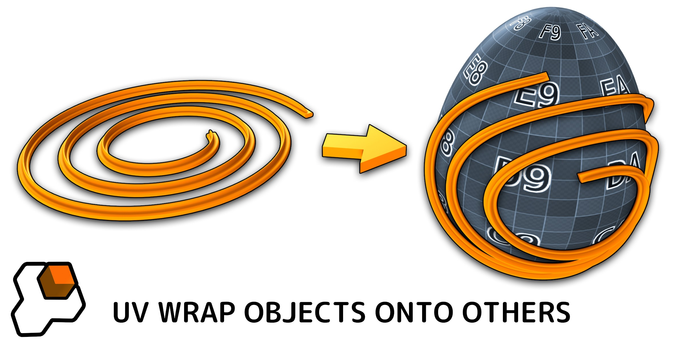
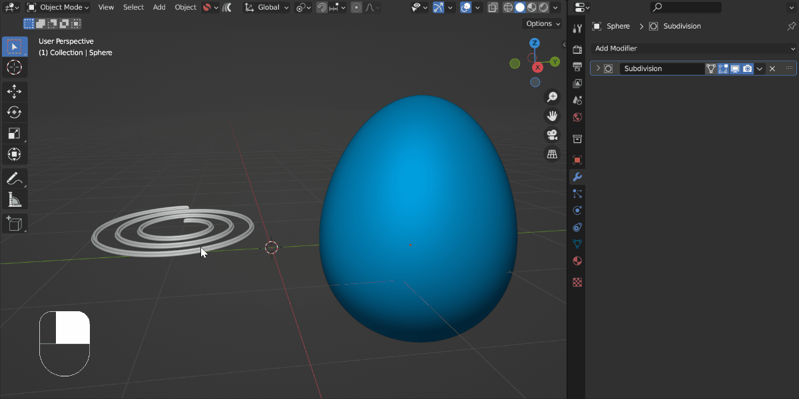

.. Mesh Materializer documentation master file, created by
   sphinx-quickstart on Mon Mar 27 14:40:26 2023.
   You can adapt this file completely to your liking, but it should at least
   contain the root `toctree` directive.

Mesh Materializer
=============================================

---------------------------------
What is Mesh Materializer?
---------------------------------

|Mesh Materializer| is a Blender add-on for any 3D modeler who needs to wrap an object onto the surface of another object just like a material, using a UV texture map as a guide.

  The **Source Object** (the spiral) is wrapped onto the **Target Object** (the egg) using the Target Object's UV Map.  It is then positioned using the modifier.

The add-on handles the complexity of doing this for you in a non-destructive way by adding a modifier.  

.. |Mesh Materializer| raw:: html

   <a href="https://blendermarket.com/products/mesh-materializer">Mesh Materializer</a>

-----------------
Features:
-----------------

* Simple right-click menu option performs the operation in one go.
* The add-on maps the *X* direction of the object to the *U* direction of the UV map and the Y direction to the V.
* Control the height of the projected object above the Target Object.
* Position, scale and rotate the object on top of the Target Object.
* Update the original Source Object and the result will change in realtime.
* A "Preview Mode" helps you position the object by unwrapping the Target Object's UVs.
* Creates a regular Blender object that can have its modifiers applied and exported or edited.
* Underlying objects is not affected.

.. toctree::
   :maxdepth: 2
   :caption: Contents:

   installation
   use
   options
   troubleshooting
   contact

Indices and tables
==================

* :ref:`genindex`
* :ref:`modindex`
* :ref:`search`
