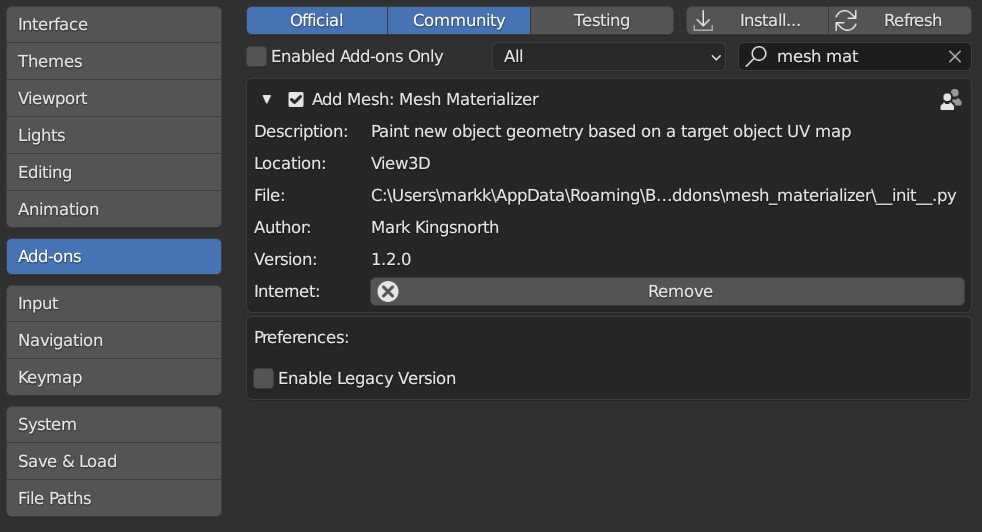

#############
Installation
#############

#. Go to *Edit* -> *Preferences*.
#. Select the *Add-ons* tab on the left if it is not already.
#. Select the *Install...* button along the top.
#. This will open a file dialog where you should navigate to where you have downloaded the **mesh_materializer.zip** file.  This file should not be unzipped.
#. Then, click the *Install add-on from file* button.
#. Search for the add-on by typing *Conform Object* in the search box if it does not already appear.
#. Make sure the checkbox next to the add-on (*Add Mesh: Mesh Materializer*) is ticked:

  Mesh Materializer Installed

If you have any issues do not hesitate to get in touch via `info@configurate.net <mailto:info@configurate.net>`_.