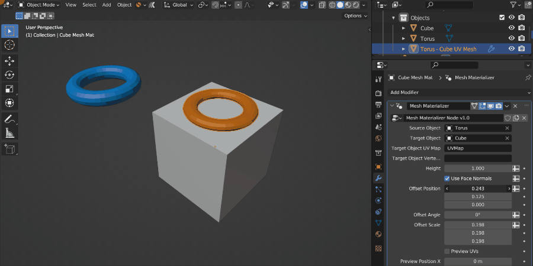
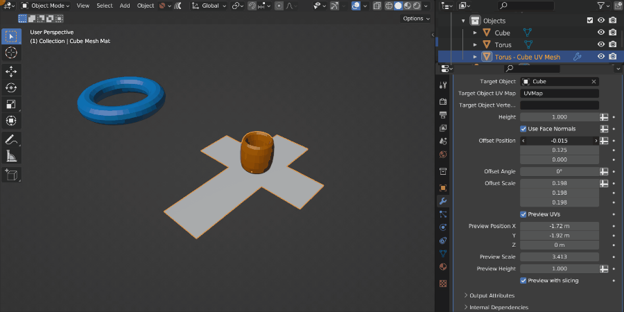
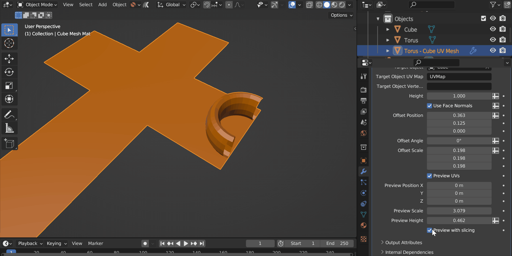

#####################################
Options
#####################################

.. figure:: images/opts_source_obj_target_obj.jpg
    :alt: The Source Object, Target Object and Materialized Object.

    The Source Object, Target Object and Mesh Mat Object.

    The Target Object's UV Map.

When the add-on runs and the **"<Target Object Name> Mesh Mat"** object is created, it has a Modifier attached to it called *Mesh Materializer* which controls all settings for how the **Source Object** is mapped onto the **Target Object**:

=====================
Modifier Settings
=====================

Source Object
--------------------

The object to be copied, deformed and wrapped around the :ref:`Target Object`'s :ref:`UV Map<Target Object UV Map>`.

Target Object
--------------------

The object that the :ref:`Source Object` will wrap around.

Target Object UV Map
--------------------

The name of the UV Map on the Target Object used to project the Source Object.

.. warning::

    The Target Object's UV Map needs to have **non overlapping faces** in order for the Add-on to work otherwise nothing may appear.  For mirrored objects, see the :ref:`Tips and Troubleshooting` section for potential workarounds.

Target Object Vertex Group
----------------------------------------

If specified, the Source Object will only be wrapped to faces with vertices assigned to this Vertex Group.  The Vertex Group needs to be added to the Target Object and vertices assigned a weight.

Height
--------------------

Because a UV Map does not really have height information, this parameter controls the height of the :ref:`Source Object` when it is projected onto the :ref:`Target Object` surface.

Use Face Normals
--------------------

By default, the Add-On will use the vertex normals of the :ref:`Target Object` to determine how the :ref:`Source Object` is projected.  On lower poly meshes, it can sometimes produce more accurate results if the :ref:`Target Object`'s' Face Normals are used instead.

In the image above, the top left low poly cube does not have enough vertex normal information, so the torus appears stretched.  In this case, ticking the *Use Face Normals* setting will make the torus less distorted, as seen in the top right cube.  In higher poly cases like the cubes at the bottom, because there is more vertex information, the *Use Face Normals* setting matters less, as there is enough Vertex and Face Normals in both cases.

Offset Position
--------------------

This will move the Source Object along the coordinates of the UV Map:

  Here the *Source Object* (The Torus) is being moved in the U direction across the UV Map.

  The same parameter being changed, but this time displayed in UV Space using the :ref:`Preview UVs` option.

Offset Angle
--------------------

  The Object is rotated around its Z axis in UV Space.

This controls the 2D rotation of the **Source Object** in UV space, therefore rotating it on the surface of the **Target Object**.

Offset Scale
--------------------

  The Source Object is being scaled in UV space.

  The same Source Object  being scaled in UV space using the :ref:`Preview UVs` option.

This controls the size of the Object in UV space.  By default, the setting will be at (1,1,1) which corresponds to the UVW coordinates in UV Space, stretching the object across the whole of one UV Map time (from 0 to 1).  The W direction influences the height of the **Source Object** as well.

Preview UVs
--------------------

  The :ref:`Preview UVs` checkbox displays the UV Map of the Target Object in 3D space with the Source Object projected onto it.  The Preview Position, Scale and Height parameters help to position the Preview object, which can be occluded by the Target Object.

It can be difficult to position the Source Object on a complex UV Map.  By ticking the :ref:`Preview UVs` checkbox, the add-on changes to a 'Preview Mode' which tries to help you by visualizing how the Source Object is projected by showing its position on the Target Object's UV Map.  You can then change the above parameters and the Source Object will also update.

Often this Preview mode may be hidden by the original Target Object, so there are additional parameters below to help you reposition it.  These parameters do not affect the final result.

.. tip::

    Because the :ref:`Height` parameter is difficult to translate to UV space, this is not shown in Preview Mode.  To reduce the height in preview mode, use the :ref:`Preview Height` parameter.

Preview Position
--------------------

Move the *Preview Mode* position in 3D space.

Preview Scale
--------------------

Scale the *Preview Mode* up or down.

Preview Height
--------------------

Change the height of the Source Object in Preview mode.  This is separate to the :ref:`Height` parameter shown in the final result.

Preview with Slicing
----------------------------------------

This stops the Source Object being sliced in *Preview Mode*, which can be helpful if the Source Object is in between UV islands.

