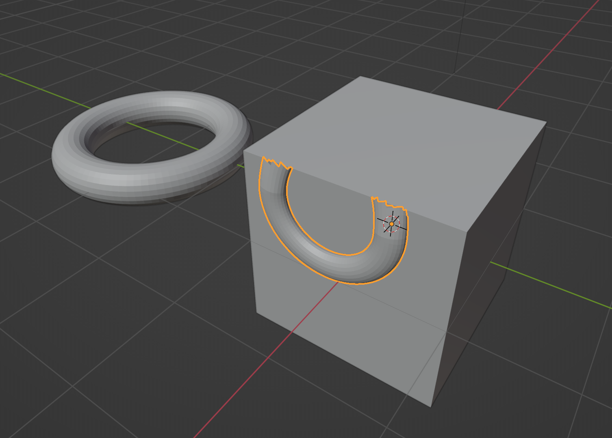
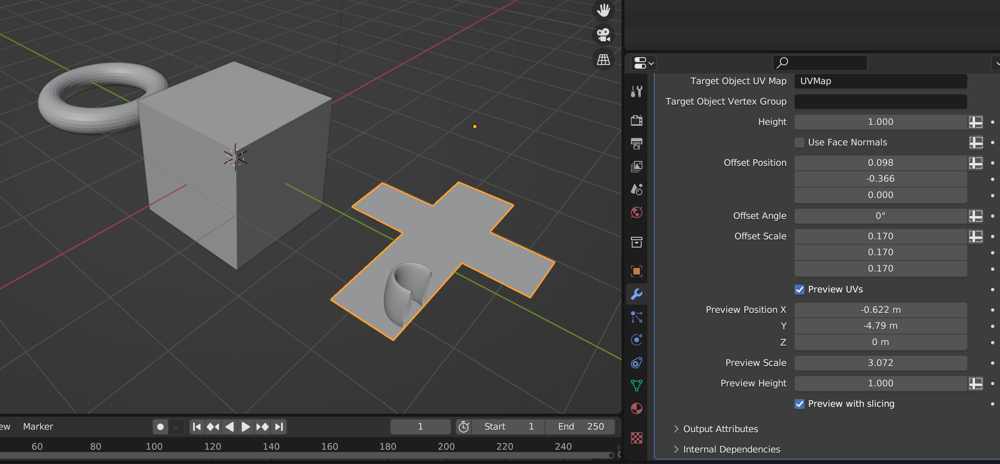
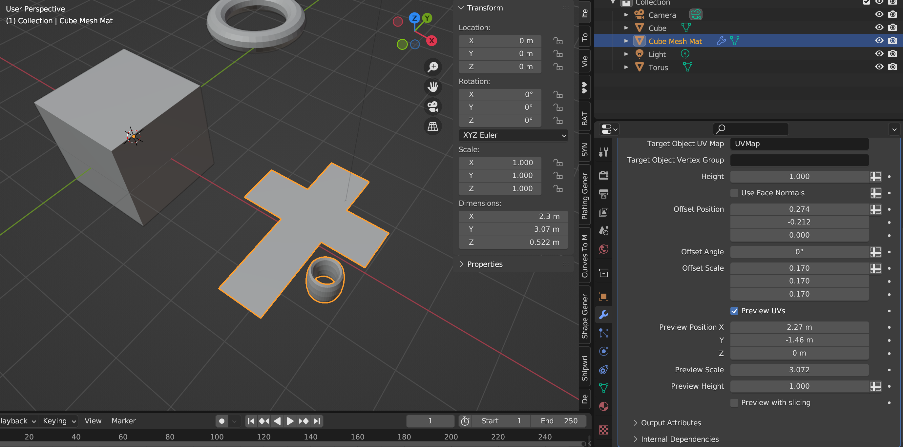
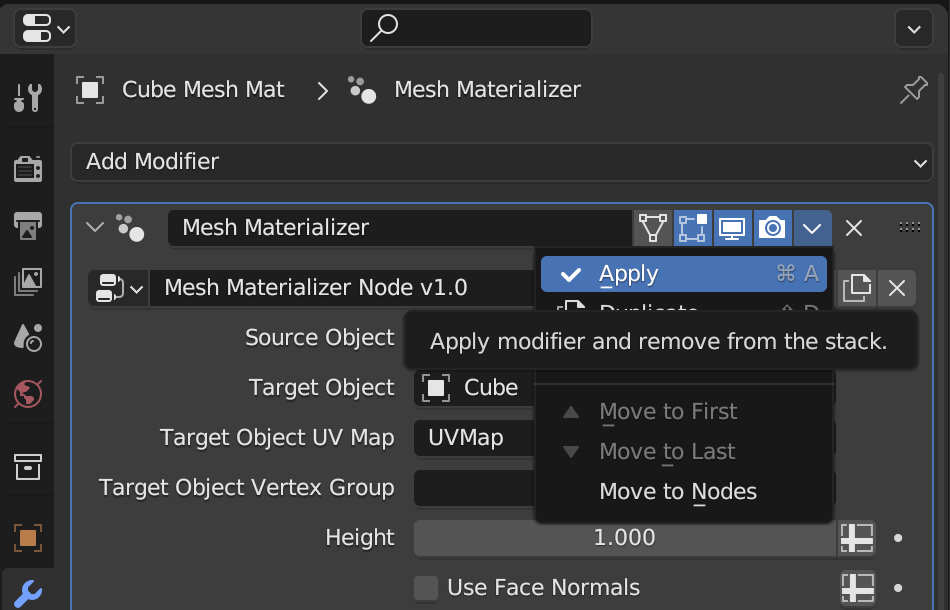
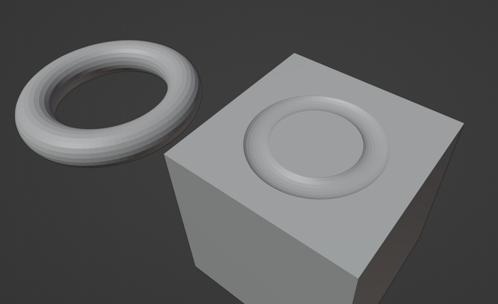

#####################################
Tips and Troubleshooting
#####################################

If you are having any issues do not hesitate to :ref:`Contact Us <contact>`

===========================================================================================
The Source Object only partially appears on the Target Object
===========================================================================================

This could be because the object is on the edge of a UV island border.  You can check this by using the :ref:`Preview UVs` mode with the :ref:`Preview with slicing` **ticked**:

In the image above you can see that the donut object was partially outside the UV border.

=================================================================================
The Source Object does not appear when I have a UV Map with overlapping faces 
=================================================================================

There is a limitation in the |Sample UV Surface Node| used by the add-on that means the Source Object can not be mapped to the Target Object when there are overlapping UV faces.  Therefore the Source Object will not appear when there are overlapping UV faces on the Target Object's UV Map. 

.. |Sample UV Surface Node| raw:: html

   <a href="https://docs.blender.org/manual/en/latest/modeling/geometry_nodes/mesh/sample_uv_surface.html#sample-uv-surface-node">Sample UV Surface Node</a>

This also affects objects with a mirrored UV Map, as the mirrored faces mean the UV Map will be overlapped.

.. tip:: Mirrored Object Workaround

    An object with a *Mirror Modifier* will have overlapping UVs by default so the Source Object will not appear, however if you limit the UV faces to one half of the UV tile and select *Mirror U* in the Mirror Modifier's *Data* tab, the UVs will no longer overlap.  
    
    .. figure:: images/mirrored_uv_workaround.png
        :alt: Mirrored UVs

    In the image above, the UVs arranged to one half of the UV tile and the *Mirror U* option is selected in the Mirror Modifier's *Data* section.

    .. figure:: images/mirrored_uv_workaround2.png
        :alt: Mirrored UVs

    Here is the same object with modifiers applied, showing how the UVs are no longer mirrored.

==============================================================
The Source Object is lost somewhere outside of the UV islands
==============================================================

If you perhaps changed the *Offset* parameters and the Source Object disappears outside of the UV islands, you can use the :ref:`Preview UVs` option with the :ref:`Preview with slicing` **unticked** to locate where the Source Object might be.

    In the image above the Preview Mode shows the donut is outside of the UV faces, so the object would not appear.

========================================================================
The Source Object has a low number of faces and does not appear at all
========================================================================

This may be because all the vertices of the object do not fit on the UV Map.  Try using the  the :ref:`Preview UVs` option with the :ref:`Preview with slicing` **unticked** to find the Source Object.

===========================================================================================
I get the error "No Mesh Data to Join" when I try to join the UV Mesh object with another
===========================================================================================

Because the *UV Mesh* object is generated from other objects, the *Mesh Materializer* modifier needs to be applied to make the mesh data permanent before it can be joined.  Do this by selecting the *UV Mesh* object, going to the modifiers tab, and selecting *Apply*.

===========================================================================================
Using the *UV Mesh* object as a Boolean cutter on the Target Object
===========================================================================================

It is best to apply the *Mesh Materializer* modifier on the *UV Mesh* object before using as a Boolean cutter on the Target Object.  Otherwise, there will be a cyclic relationship between the Target Object and the *UV Mesh* cutter.

==================================
Having any other issues?
==================================

Do not hesitate to :ref:`Contact Us <contact>` if you are having any other issues, questions, or new feature requests.

