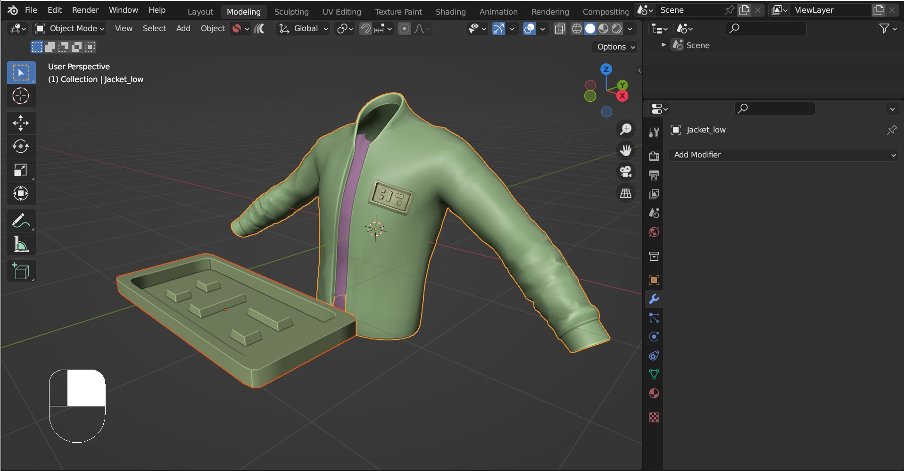
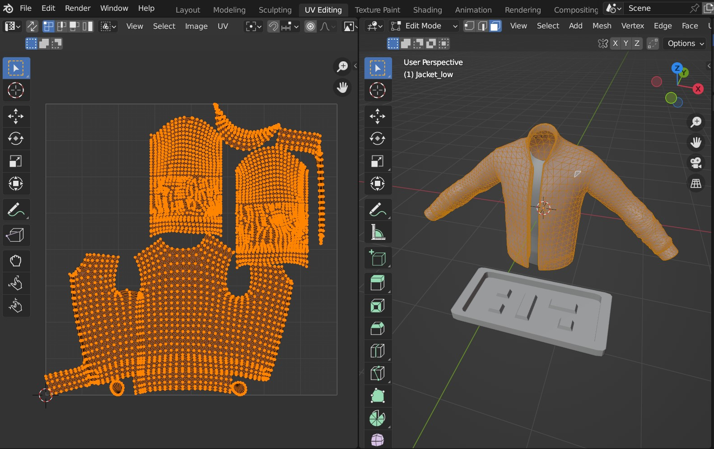

#####################################
How To Use
#####################################

    Here we will project a rectangular badge onto a Jacket (Jacket Credit: |Curtis Kinney|)

.. |Curtis Kinney| raw:: html

   <a href="https://skfb.ly/6U8uT">Curtis Kinney</a>

    The Jacket's UV Map.

===========================
Step by Step
===========================

#. In Blender, first select the **Source Object** (the object to be projected).

    .. image:: images/source_object_select.jpg
        :alt: Mesh Materializer

    .. warning::

        Ideally, **Source Objects** should:

        * Have a good level of topology so that they can be deformed (good number of vertices and quad faces).
        * Not have parents/children.

#. Then press *shift* and select the **Target Object** (the object we are projecting onto).  Both objects should be selected.

    .. tip::

        The Target Object is expected to have at least one UV Map.  Whichever UV Map is selected under the *Object Data Properties* tab on the right hand side will be used.

        .. image:: images/target_object_select.jpg
            :alt: Mesh Materializer

    .. warning::

        The Target Object's UV Map needs to have **non overlapping faces** in order for the Add-on to work otherwise nothing may appear.  For mirrored objects, see the :ref:`Tips and Troubleshooting` section for potential workarounds.

#. Right-Click in the viewport, and select *Mesh Materializer - Create UV Mesh* from the submenu that appears.

    .. image:: images/right-click-menu.jpg
        :alt: Mesh Materializer

#. A new object will be created named **"<Target Object Name> Mesh Mat"** with the *Mesh Materializer* modifier added.  Initially this new object may appear strange, because the **Source Object** has been stretched across the entire UV Map of the **Target Object**:

    .. image:: images/howto_initial.jpg
        :alt: Mesh Materializer

#. With the new object selected, switch to the *Modifiers* tab on the right hand side.  Try reducing the *Offset Scale* parameter down to shrink the **Source Object** projection.  In this case, the object appears on the back of the Jacket.

    .. image:: images/mesh_mat_scaling.gif
        :alt: Mesh Materializer

#. Notice that the badge edges are trimmed because they are on the boundary of the Jacket's UV Map.

    .. image:: images/badge_trimmed.jpg
        :alt: Mesh Materializer

    .. tip::

        This can also be visualised by ticking the *Preview UVs* checkbox in the *Mesh Materializer* modifier.  This will display the **Target Object**'s UV Map in the viewport with the **Source Object** projected onto it.

        .. figure:: images/preview_uvs_jacket.jpg
            :alt: Mesh Materializer

            Here the *Preview UVs* mode is ticked, which switches on the UV Preview.  The Source Object can be seen just on the edge of the UV island.  Also, the Preview *Offset* and *Scale* parameters have been changed to move the preview object into view.

#. Unticking the *Preview Mode*, change the *Offset* parameters to move the Source Object along the **Target Object**'s surface.

    .. figure:: images/mesh_mat_jacket_moving_badge.gif
        :alt: Mesh Materializer

        The *Offset* position and scale parameters are used to move the badge onto the front of the Jacket's chest.

#. You can then make some finer adjustments: change the *height* of the object, move the object above the surface using the *Offet Position* Z parameter, and adjust the proportions of the object using the *Source Scale* parameter.

    .. figure:: images/mesh_mat_jacket_adjusting_badge.gif
        :alt: Mesh Materializer

        The *Height*, *Offset Position* and *Offset Scale* parameters are used to adjust the object position.

#. Explore the :ref:`Options` for the *Mesh Materializer* modifier further and do not hesitate to :ref:`get in touch <Contact>` if you have any questions.

.. tip::

    Remember that the new object will be updated if the **Source Object** or the **Target Object** are changed.

    .. figure:: images/change_source_obj.gif
        :alt: Mesh Materializer

